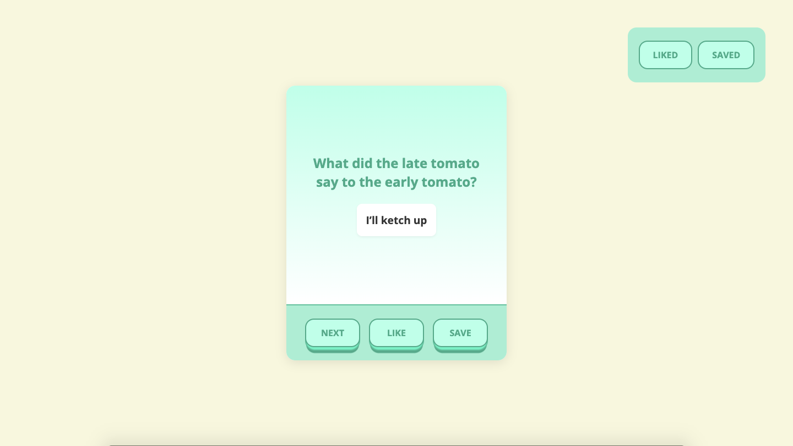
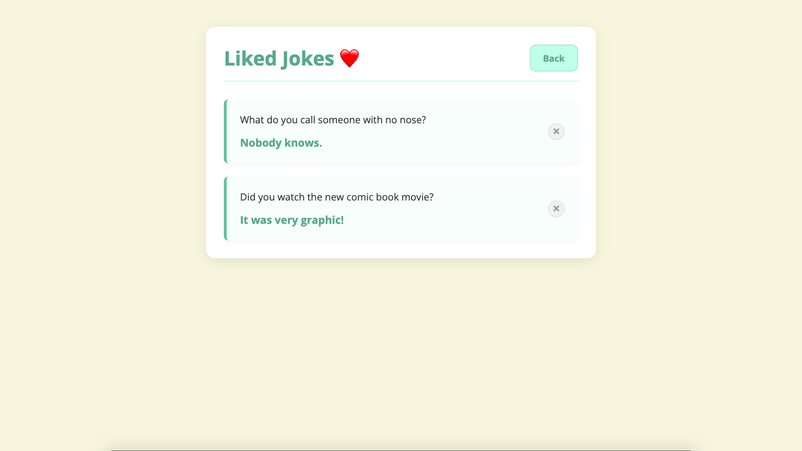
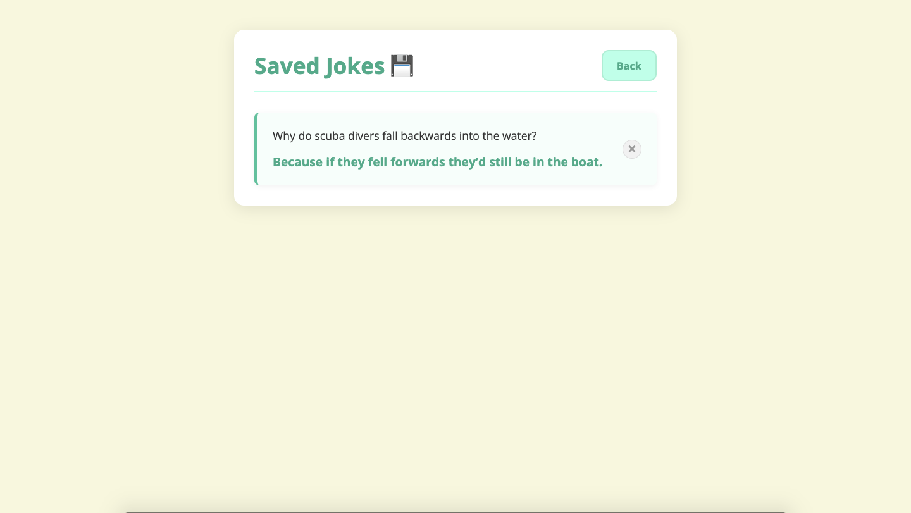
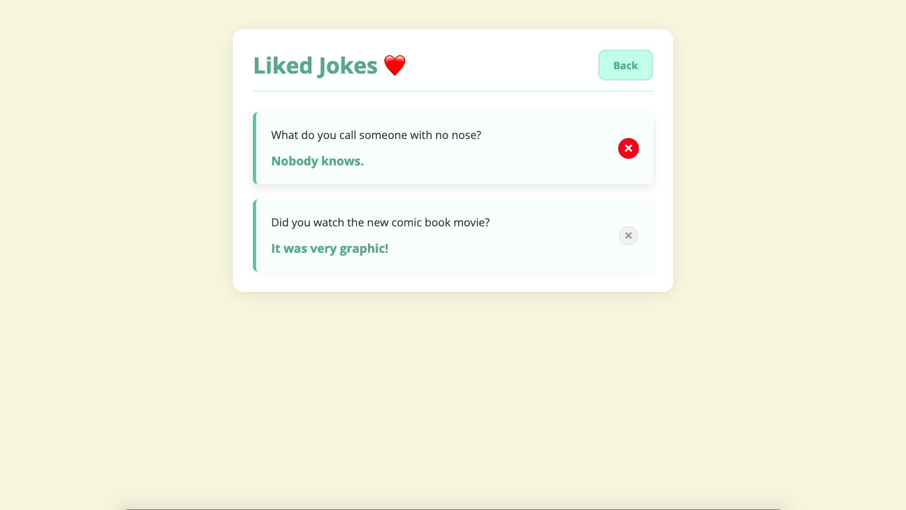

# 😂 Joke App

A fun and interactive Joke App built with **React**. It fetches random jokes from an API, allows users to **like** or **save** them, and stores the favorites using a local JSON database (`json-server`).

## 🚀 Features

- **Get Random Joke**: Automatically fetches a random joke on load
- **Like a Joke**: Click to save jokes you liked into `likedJokes`
- **Save a Joke**: Click to store jokes into `savedJokes` for later
- **Message Feedback**: Temporary confirmation after actions
- **Data Persistence**: Uses `json-server` to simulate backend storage

## 💻 Technologies Used

- React
- JavaScript (ES6+)
- localStorage (optional)
- json-server
- HTML5 & SCSS

## 🧩 How It Works

- When you open the app, it fetches a random joke from [Official Joke API](https://official-joke-api.appspot.com/)
- Clicking **Like** or **Save** sends the joke to `http://localhost:3001/likedJokes` or `savedJokes` via `fetch POST`
- Feedback messages appear when the joke is saved or liked

## 📸 Screenshot

# 🏠 Main page


# ❤️ Liked jokes


# 📂 Saved jokes


# 🚫 Deleting jokes


## 📦 Getting Started

1. Clone the repo:
   ```bash
   git clone https://github.com/MambaXan/Joke-app.git

2. Navigate into the folder
    cd joke-app

3. Install dependencies
    npm install

4. Run the mock backend
    npx json-server --watch db.json --port 3001

5. Start the React app
    npm start